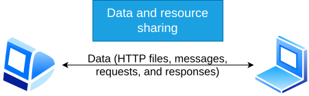
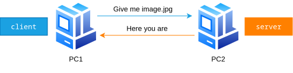
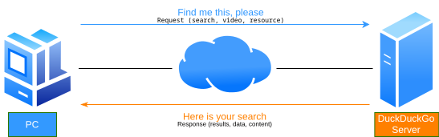
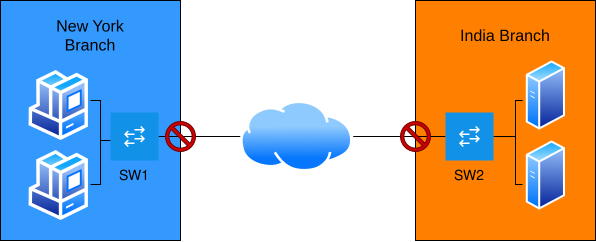
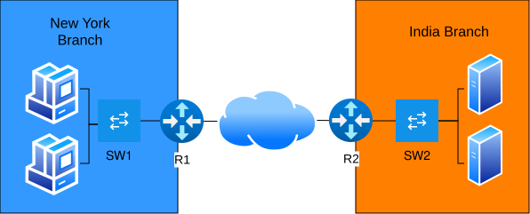
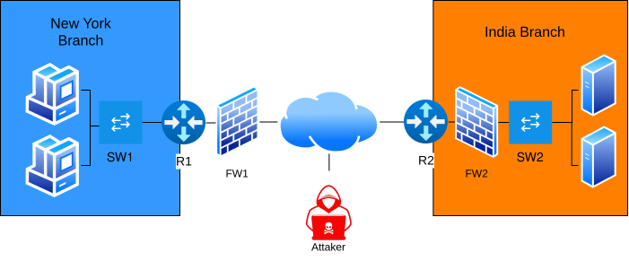
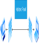

## 00.01 Definition – Computer Network
A set of interconnected devices that allows data exchange and the sharing of resources.  
Data is **information** that is transmitted over the network. Data **is sent and received**.
- Files (PDFs, images, videos)
- Emails
- Messages
- Packets that travel over the Internet
- Requests and responses (HTTP, DNS, etc.)
Resources are **elements or services** that the network allows you to **use or share**. Resources **are used**, not just sent.
- Network printers
- Servers (web, file, mail)
- Shared storage
- Internet connection
- Network applications or services

## 
## 00.02 Definition – Nodes
Devices that connect to a network and participate in communication.
- **routers** -> Network device that connects different networks to each other, directing data packets by choosing the best route
- **switches** -> Network device that interconnects devices within the same network and sends data only to the correct destination.
- **firewalls** -> Security device or system that controls and filters network traffic according to defined rules.
- **servers** -> Device or system that provides services, resources, or data to other devices on the network.
- **clients** -> Device or system that requests or uses the services, resources, or data provided by a server.
## Servers and clients are also called **end hosts** or **endpoints**.
## 00.03 Servers and clients
When a device (for example, a PC) requests files from another, **the one that makes the request acts as the client** and **the one that responds by sending the files acts as the server**.

The same happens with all the services we know, “YouTube, DuckDuckGo, NextDNS, etc.” However, services send data in parts, as it is requested (“watching a video, a search, etc.”).

## 
## 00.04 Switches
A switch is a network device that connects multiple devices within a local area network (LAN), and is responsible for sending data only to the correct destination device, using MAC addresses.

Switches have multiple network ports so that end devices (hosts), such as PCs, can connect within a local area network (LAN).
For communication to exist between different networks over the Internet, another network device is required: the router.
For example, if a device in the New York branch needs documents stored on the network in India, routers are responsible for sending the data between both networks.
**The switch connects devices; the router connects networks and the Internet.**

## 
## 00.05 Firewalls
A firewall is a security device or system that controls and filters incoming and outgoing network traffic according to a set of security rules, with the goal of protecting the internal devices of a network.
### Network firewalls
It can be integrated into a router or operate as a standalone device. It is responsible for filtering network traffic according to security rules and decides which traffic is allowed and which is blocked.

### Host-based firewalls
These are software firewalls that filter traffic entering and leaving a specific device (host), such as a PC. Most operating systems include a firewall as an additional line of defense.

**The network firewall protects the entire network; the host firewall protects a single device.**